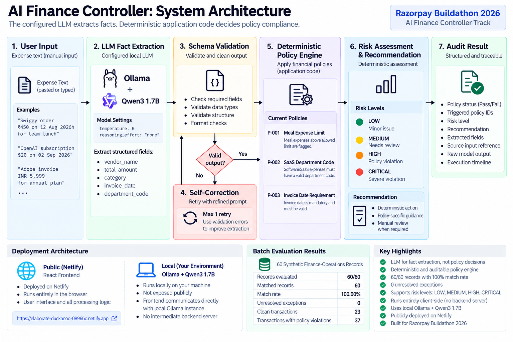

# AI Finance Controller: Agentic Policy Engine

> **The configured LLM extracts facts. Deterministic application code decides policy compliance.**

Built for the **Razorpay Buildathon 2026 — AI Finance Controller track**.

[Live Demo](https://elaborate-duckanoo-08966c.netlify.app) · [Repository](https://github.com/BasuSourav140/ai-finance-controller) · [Razorpay Buildathon](https://razorpay.com/buildathon/)

AI Finance Controller is an AI-assisted finance-operations control system that turns unstructured expense documents into structured facts, validates those facts, applies deterministic financial policies, assigns risk, and produces an auditable recommendation.

The project is designed around a simple boundary:

```text

LLM = interpretation

Application code = financial control

```

That boundary is intentional. The model helps understand messy finance data; it does **not** get to decide whether a policy was violated.

---

## Razorpay Buildathon 2026: Track Alignment

The Razorpay Buildathon 2026 **AI Finance Controller** track asks builders to close one finance-operations loop across a **50+ record synthetic-data batch**, report a **match rate**, and surface the **exceptions the system could not resolve**. Razorpay's stated bar is **throughput + measured accuracy + an honest exception list**.

This project is built around that requirement:

| Track requirement | Project implementation |

| --- | --- |

| Finance-operations workflow | Expense / invoice policy auditing |

| 50+ record synthetic batch | Built-in synthetic evaluation dataset and full-benchmark flow |

| Measured accuracy | Expected-vs-actual batch evaluation and match rate |

| Honest exceptions | Explicit unresolved-exception view |

| Meaningful AI use | LLM extracts facts from unstructured transaction text |

| Reliable controls | Deterministic policy engine evaluates compliance |

| Auditability | Policy IDs, risk, recommendation, source input, raw model output, and execution timeline |

### Final Benchmark Result

The current controller was evaluated against the final **60-record synthetic finance-operations dataset** using the configured local LLM setup (**Ollama + Qwen3 1.7B**).

| Metric | Result |

| --- | ---: |

| Records evaluated | **60/60** |

| Matched records | **60** |

| Match rate | **100.00%** |

| Unresolved exceptions | **0** |

| Clean transactions | **23** |

| Transactions with policy violations | **37** |

The benchmark comparison requires the expected policy status, expected risk level, and expected policy IDs to all match the controller output.

During benchmark validation, three synthetic ground-truth labels were found to assign **P-002 (SaaS Department Code)** to transactions whose category was **Meal**. Because P-002 applies only to Software/SaaS expenses, those three labels were corrected to align the synthetic ground truth with the registered deterministic policy definitions. A prior run against the inconsistent labels produced **57/60 matches (95.00%)**; the final 60-record run after the ground-truth correction produced **60/60 matches (100.00%)** with **0 unresolved exceptions**.

The result is a measurement against this synthetic dataset and configured model, not a claim of universal real-world accuracy. The benchmark measures the full controller pipeline: LLM fact extraction, schema validation, bounded self-correction when required, deterministic policy evaluation, and deterministic risk/recommendation logic.

---

# What the Controller Does

The controller closes the following expense-control loop:

```text

Invoice / Receipt / Expense Text

              ↓

       LLM Fact Extraction

              ↓

        JSON Validation

              ↓

   Bounded Self-Correction

        (max 1 retry)

              ↓

   Deterministic Policy Engine

              ↓

        Risk Assessment

              ↓

    Financial Recommendation

              ↓

      Auditable Decision

```

The system currently evaluates three explicit policies:

```text

P-001  Meal Expense Limit

P-002  SaaS Department Code

P-003  Invoice Date Requirement

```

It can also evaluate a synthetic batch against expected ground truth and report where the controller disagrees with that ground truth.

---

# Why This Architecture?

Traditional invoice automation often stops here:

```text

Document

   ↓

OCR / Extraction

   ↓

Structured Data

```

The controller adds the part that matters for a financial-control workflow:

> **Does the extracted transaction comply with the company's financial policy?**

Instead of asking the LLM to answer that question directly, the system uses the model for extraction and the application for enforcement.

```text

┌──────────────────────────────┐

│       Configured LLM         │

│                              │

│ Extract factual fields from  │

│ unstructured documents       │

└──────────────┬───────────────┘

               │

               ▼

┌──────────────────────────────┐

│      JSON / Schema Check      │

│                              │

│ Is the extracted response    │

│ structurally usable?          │

└──────────────┬───────────────┘

               │

               ▼

┌──────────────────────────────┐

│   Deterministic Policy       │

│          Engine              │

│                              │

│ Does the transaction comply? │

└──────────────┬───────────────┘

               │

               ▼

┌──────────────────────────────┐

│       Risk + Recommendation  │

└──────────────────────────────┘

```

This prevents an LLM-generated compliance opinion from silently becoming the final financial-control decision.

---

# Core Design Principle

> **The configured LLM extracts facts. Deterministic application code decides policy compliance.**

The extraction prompt explicitly tells the model **not** to:

- decide whether a policy was violated

- calculate risk

- generate compliance decisions

- generate policy violations

- generate recommendations

- invent missing information

The application then evaluates the extracted fields independently. This separation makes the control layer predictable, testable, explainable, and auditable.

---

# Agentic Self-Correction

The controller does not blindly trust the first model response.

The LLM response is parsed and validated locally. When the response is malformed or does not match the expected extraction structure, the controller performs **one bounded correction attempt**.

```text

LLM Response

     ↓

JSON / Schema Validation

     │

     ├── VALID ───────────────→ Policy Engine

     │

     └── INVALID

            ↓

      Correction Prompt

            ↓

          Retry #1

            ↓

     JSON / Schema Validation

            │

            ├── VALID ───────→ Policy Engine

            │

            └── INVALID ─────→ Manual Review

```

The correction prompt contains the source document, the previous model response, and schema-validation context. The retry is deliberately bounded to one attempt so an invalid response cannot create an uncontrolled model-call loop.

### Why one retry?

```text

Retry 0 → initial extraction

Retry 1 → correction attempt

Retry 2+ → not allowed

```

A finance-control workflow should prefer explicit failure over an invisible, potentially expensive retry loop.

---

# Fail-Closed Behavior

The controller separates malformed model output from API failures.

### Model-output failure

```text

Invalid JSON / invalid extracted structure

                  ↓

            Self-correction

                  ↓

               Retry #1

                  ↓

              Validation

                  ↓

       Valid → continue

       Invalid → manual review

```

### API failure

```text

Authentication / rate limit / network error

                  ↓

                 Stop

                  ↓

        Surface actionable error

```

An API failure is not treated as if the model merely produced a malformed answer. Likewise, an invalid model response is never silently converted into financial approval.

---

# Deterministic Policy Engine

The current controller enforces three policies.

## P-001 — Meal Expense Limit

Any meal expense **above ₹3,000** is flagged for review.

```text

Category = Meal

        +

Amount > ₹3,000

        ↓

P-001 VIOLATION

```

Example:

```text

Meal amount: ₹4,720

Policy limit: ₹3,000

Result: FAIL

Policy: P-001

```

---

## P-002 — SaaS Department Code

Software / SaaS expenses must contain a department code.

```text

Software / SaaS

       +

Missing department_code

       ↓

P-002 VIOLATION

```

Example:

```text

Category: SaaS

Department code: Missing

Result: FAIL

Policy: P-002

```

---

## P-003 — Invoice Date Requirement

Every invoice must contain an invoice date.

```text

Missing invoice date

       ↓

P-003 VIOLATION

       ↓

CRITICAL RISK

```

---

# Policy Registry

The controller maintains its active financial policies through a structured policy registry.

Each policy contains:

- A unique policy ID

- A policy name

- A human-readable description

Current policies:

```text

┌────────┬────────────────────────────────────┐

│ P-001  │ Meal Expense Limit                 │

├────────┼────────────────────────────────────┤

│ P-002  │ SaaS Department Code               │

├────────┼────────────────────────────────────┤

│ P-003  │ Invoice Date Requirement           │

└────────┴────────────────────────────────────┘

```

The policy registry provides a centralized representation of the rules enforced by the deterministic policy engine.

Policy evaluation itself remains deterministic application logic. The LLM does not decide whether a policy has been violated.

Deterministic violations carry structured information such as:

```ts

{

  policy_id: string;

  policy_name: string;

  message: string;

}

```

That lets the audit interface show **which rule failed and why**.

---

# Risk Assessment

The controller derives an overall risk level from deterministic policy results.

Supported levels:

```text

LOW

MEDIUM

HIGH

CRITICAL

```

Current policy-to-risk behavior:

```text

No violations

    ↓

LOW

One violation

    ↓

MEDIUM

Two or more violations

    ↓

HIGH

Missing invoice date

    ↓

CRITICAL

```

A missing invoice date takes precedence and produces `CRITICAL` risk.

---

# Recommendation Engine

The recommendation layer converts deterministic policy results into an actionable finance-control recommendation.

For a compliant transaction:

```text

Approve automatically.

Transaction complies with current company policy.

```

For a violation, the recommendation depends on the deterministic policy outcome. For example:

```text

Request an itemized receipt and obtain manager approval

before reimbursement.

```

The recommendation is generated **after** policy evaluation. The LLM does not independently select the final financial-control action.

---

# Batch Evaluation & Benchmarking

This is the part of the project most directly aligned with the Razorpay Finance Controller track.

The application includes a synthetic evaluation dataset and a batch evaluator. Each record has expected ground-truth attributes, while the controller produces actual attributes after processing the record.

The evaluator compares:

- Expected policy status vs. actual policy status

- Expected risk level vs. actual risk level

- Expected policy IDs vs. actual policy IDs

A record is treated as a match only when the evaluated output agrees with the expected result across the comparison fields.

### Reported metrics

```text

Total records

Processed records

Matched records

Match rate

Exception count

Policy violation count

Clean transaction count

Unresolved exceptions

```

Conceptually:

```text

Synthetic Finance Dataset

          ↓

     Batch Evaluator

          ↓

    AI Finance Controller

          ↓

    Expected vs Actual

          ↓

 ┌───────────────────────┐

 │ Match Rate            │

 │ Matched Records       │

 │ Exceptions            │

 │ Unresolved Records    │

 └───────────────────────┘

```

The UI exposes two benchmark actions:

```text

Test 3 Records

Run Full Benchmark

```

During the full run, the interface reports processing progress and then lists the unresolved exceptions.

### Important evaluation rule

The benchmark score is **not** a claim that the system has a universal accuracy rate. It measures the current controller against the supplied synthetic ground truth using the currently configured LLM.

The final benchmark was run against the corrected 60-record synthetic dataset and produced 60/60 matches (100.00%) with 0 unresolved exceptions.

---

# Agent Execution Timeline

The dashboard exposes the application's observable execution stages:

### Normal execution

```text

Document Extraction

        ↓

JSON Validation

        ↓

Policy Evaluation

        ↓

Audit Completed

```

### Self-correction execution

```text

Document Extraction

        ↓

JSON Validation

        ↓

Self-Correction

        ↓

Retry #1

        ↓

2nd JSON Validation

        ↓

Policy Evaluation

        ↓

Audit Completed

```

### Unrecoverable validation failure

```text

Document Extraction

        ↓

JSON Validation

        ↓

Self-Correction

        ↓

Retry #1

        ↓

2nd JSON Validation

        ↓

INVALID

        ↓

Manual Review

```

The timeline shows application-level events only. It does not expose private model reasoning or hidden chain-of-thought.

---

# Why This Is Agentic

The agentic behavior is deliberately bounded rather than open-ended. The controller observes the result of each extraction attempt, validates it, decides whether correction is needed, and either continues the workflow or stops for manual review.

```text

Observe → Validate → Correct when needed → Re-validate

                                      │

                         success ─────┴───── failure

                           ↓                    ↓

                     Apply policy        Manual review

```

This gives the system an explicit control loop while keeping financial policy enforcement deterministic.

---

# System Architecture



```text

                           ┌─────────────────────┐

                           │        User         │

                           │ Invoice / Receipt   │

                           └──────────┬──────────┘

                                      │

                                      ▼

                           ┌─────────────────────┐

                           │   React Frontend    │

                           │ Transaction Input   │

                           └──────────┬──────────┘

                                      │

                                      ▼

                           ┌─────────────────────┐

                           │   Configured LLM    │

                           │ Fact Extraction     │

                           └──────────┬──────────┘

                                      │

                                      ▼

                           ┌─────────────────────┐

                           │ JSON / Schema       │

                           │ Validation          │

                           └──────────┬──────────┘

                                      │

                         ┌────────────┴────────────┐

                         │                         │

                      INVALID                   VALID

                         │                         │

                         ▼                         │

                ┌──────────────────┐              │

                │ Self-Correction  │              │

                │ Maximum 1 Retry  │              │

                └────────┬─────────┘              │

                         │                         │

                         ▼                         │

                ┌──────────────────┐              │

                │ 2nd Validation   │              │

                └────────┬─────────┘              │

                         │                         │

                      VALID                        │

                         │                         │

                         └────────────┬────────────┘

                                      ▼

                           ┌─────────────────────┐

                           │ Deterministic       │

                           │ Policy Engine       │

                           └──────────┬──────────┘

                                      │

                                      ▼

                           ┌─────────────────────┐

                           │ Risk Assessment     │

                           └──────────┬──────────┘

                                      │

                                      ▼

                           ┌─────────────────────┐

                           │ Recommendation      │

                           │ Engine              │

                           └──────────┬──────────┘

                                      │

                                      ▼

                           ┌─────────────────────┐

                           │ Audit Result        │

                           │ + Agent Timeline    │

                           └─────────────────────┘

                         2nd validation failure

                                      │

                                      ▼

                           ┌─────────────────────┐

                           │ Manual Review       │

                           └─────────────────────┘

```

The application is intentionally client-side in its current form. There is no intermediate application backend between the browser and the configured LLM endpoint. The public Netlify deployment hosts the React frontend; a judge or other user must provide a browser-reachable compatible LLM endpoint to perform live audits.

---

# Live Deployment

The current React frontend is publicly deployed on Netlify:

**https://elaborate-duckanoo-08966c.netlify.app**

The deployment is a frontend deployment only. The buildathon benchmark was executed locally with Ollama + Qwen3 1.7B. Because the application calls the configured LLM directly from the browser, the live site does not automatically expose the developer's local Ollama instance to other users.

For an external user to run an audit from the deployed site, the user must configure an LLM endpoint that is reachable from their browser and supports the documented chat-completions-style contract and CORS requirements.

# LLM Configuration

The current implementation is **provider-neutral at the application layer**.

The validated benchmark configuration used **Ollama + Qwen3 1.7B** through an OpenAI-compatible chat-completions endpoint. For this extraction-only workload, the client requests **reasoning_effort: none** and uses **temperature: 0** to keep generation focused on structured fact extraction.

Instead of hard-coding one model vendor, the UI accepts:

| Setting | Required | Purpose |

| --- | --- | --- |

| Endpoint | Yes | HTTP endpoint receiving the extraction request |

| Model | No | Model identifier, when the endpoint expects one |

| Credential | No | Bearer credential when the endpoint requires authentication |

The current client expects a **chat-completions-style JSON HTTP contract**. It is not a universal adapter for every provider-native API.

## Request contract

```http

POST \<configured-endpoint>

Content-Type: application/json

Authorization: Bearer \<credential>   # only when configured

```

```json

{

  "model": "...",

  "messages": [

    {

      "role": "user",

      "content": "\<extraction prompt>"

    }

  ],

  "temperature": 0,

  "reasoning_effort": "none",

  "response_format": {

    "type": "json_schema",

    "json_schema": {

      "name": "invoice_extraction",

      "strict": true,

      "schema": {

        "type": "object",

        "properties": {

          "vendor_name": { "type": "string" },

          "total_amount": { "type": "number" },

          "category": { "type": "string" },

          "invoice_date": { "type": "string" },

          "department_code": { "type": "string" }

        },

        "required": [

          "vendor_name",

          "total_amount",

          "category",

          "invoice_date",

          "department_code"

        ],

        "additionalProperties": false

      }

    }

  }

}

```

## Expected response contract

The client expects the generated extraction text in a response shaped like:

```json

{

  "choices": [

    {

      "message": {

        "content": "{\"vendor_name\":\"Example Vendor\", ...}"

      }

    }

  ]

}

```

The application then parses and validates the returned JSON locally before running policy evaluation.

### CORS requirement

Because the current application calls the configured endpoint directly from the browser, the endpoint must permit the browser origin through an appropriate **CORS configuration**. This is a deployment requirement of the current client-side architecture.

---

# Bring Your Own Key / Credential

The application follows a browser-based **BYOK / user-supplied credential** model.

```text

User

 │

 │ Endpoint + optional credential

 ▼

React Frontend

 │

 │ HTTP request

 ▼

Configured LLM Endpoint

```

The configuration is stored locally in browser storage so that the application can remember the endpoint, model, and optional credential between sessions.

## Security limitation

This is appropriate for a **demo / buildathon prototype**, but it should not be mistaken for production-grade secret management.

Because the request originates in the browser:

- The configured credential is available to the client application.

- The credential is stored in browser local storage by the current implementation.

- There is no backend secret vault.

- There is no server-side authentication gateway.

- Anyone using the browser session should be assumed able to access client-side configuration.

For production, the expected architecture is to move provider credentials behind a trusted backend or model gateway.

---

# Data Handling

The current implementation does not use an intermediate application backend or persistent application database for audit records.

Transaction text is sent directly from the browser to the configured LLM endpoint according to the user's endpoint and credential configuration.

Provider-side data handling, logging, retention, and privacy therefore depend on the configured endpoint and its policies.

The application does **not** make independent guarantees about provider-side retention or zero-retention behavior.

---

# User Experience

The dashboard is designed as an enterprise-style financial control center.

### Header

Shows the controller identity and the configured LLM status.

### Policy Panel

Displays the active policies:

```text

P-001  Meal Expense Limit

      Maximum ₹3,000

P-002  SaaS Department Code

      Department code required

P-003  Invoice Date Requirement

      Invoice date required

```

### Transaction Input

Users can paste:

- invoices

- receipts

- expense records

- structured or semi-structured transaction text

### Batch Evaluation Panel

Shows:

```text

Records

Match Rate

Matched

Exceptions

Clean

```

and, when needed, an **Unresolved Exceptions** section showing expected vs. actual output.

### Audit Dashboard

The main dashboard tracks:

- Total amount processed

- Policy violation count

- Clean transaction count

- Audit results

- Policy status

- Risk level

- Recommendations

### Detailed Audit Drawer

A selected audit exposes the chain from source input to decision:

```text

Transaction Summary

        ↓

Policy Evaluation

        ↓

Policy IDs

        ↓

Risk Level

        ↓

Strategic Recommendation

        ↓

Raw Agent JSON

        ↓

Original Transaction Input

```

This creates a visible audit trail without relying on model reasoning as the source of truth.

---

# Example Audit

## Clean SaaS Transaction

```text

Vendor: CloudStack Technologies

Category: SaaS

Total: ₹5,723

Department Code: ENG-001

Invoice Date: 2026-08-28

```

Expected application result:

```text

PASS

LOW RISK

P-001 ✓

P-002 ✓

P-003 ✓

```

## Meal Policy Violation

```text

Vendor: Royal Kitchen

Category: Meal

Total: ₹4,720

Department Code: HR-002

Invoice Date: 2026-08-29

```

Expected application result:

```text

FAIL

MEDIUM RISK

P-001 ✕

Meal Expense Limit

Meal expense exceeds the ₹3,000 limit.

```

The recommendation is produced by deterministic application logic after policy evaluation.

---

# Test Scenarios

| Scenario | Input condition | Expected status | Expected policy | Expected risk |

| --- | --- | --- | --- | --- |

| Clean transaction | SaaS + department code + invoice date present | PASS | None | LOW |

| Meal limit | Meal amount > ₹3,000 | FAIL | P-001 | MEDIUM |

| SaaS coding | SaaS without department code | FAIL | P-002 | MEDIUM |

| Missing date | Invoice date missing | FAIL | P-003 | CRITICAL |

| Multiple violations | More than one policy violation | FAIL | Multiple | HIGH unless P-003 applies |

### Self-correction scenario

When an LLM response cannot be parsed or validated:

```text

Validation Failure

        ↓

Correction Prompt

        ↓

Retry #1

        ↓

Validation

        ↓

Policy Evaluation

```

If the second response is still invalid, the controller stops and requires manual review.

---

# Project Structure

```text

ai-finance-controller/

│

├── public/

│

├── src/

│   ├── components/

│   │   ├── AgentActivity.tsx

│   │   ├── AuditTable.tsx

│   │   ├── BatchEvaluationPanel.tsx

│   │   ├── Header.tsx

│   │   ├── Metrics.tsx

│   │   ├── PolicyPanel.tsx

│   │   └── ResultDrawer.tsx

│   │

│   ├── data/

│   │   └── evaluationDataset.ts

│   │

│   ├── services/

│   │   ├── aiAgent.ts

│   │   ├── batchEvaluator.ts

│   │   ├── policyEngine.ts

│   │   ├── recommendationEngine.ts

│   │   └── llm/

│   │       ├── extractionSchema.ts

│   │       ├── llmClient.ts

│   │       └── llmConfig.ts

│   │

│   ├── types/

│   │   └── index.ts

│   │

│   ├── App.tsx

│   ├── App.css

│   ├── index.css

│   └── main.tsx

│

├── .gitignore

├── LICENSE

├── index.html

├── package.json

├── package-lock.json

├── postcss.config.js

├── tailwind.config.js

├── tsconfig.app.json

├── tsconfig.json

├── tsconfig.node.json

├── vite.config.ts

└── README.md

```

### Important modules

| Module | Responsibility |

| --- | --- |

| `aiAgent.ts` | Orchestrates extraction, validation, bounded correction, policy evaluation, and recommendation |

| `llmClient.ts` | Sends the provider-neutral HTTP request and parses the configured endpoint response |

| `extractionSchema.ts` | Defines the structured extraction schema |

| `llmConfig.ts` | Loads and stores endpoint/model/credential configuration locally |

| `policyEngine.ts` | Performs deterministic financial-policy evaluation |

| `recommendationEngine.ts` | Produces recommendations from policy outcomes |

| `batchEvaluator.ts` | Runs the synthetic benchmark and computes metrics/exceptions |

| `evaluationDataset.ts` | Supplies expected ground truth for synthetic evaluation |

| `BatchEvaluationPanel.tsx` | Presents benchmark progress, match rate, and unresolved exceptions |

---

# Getting Started

## Prerequisites

- Node.js

- npm

- Access to an LLM endpoint compatible with the HTTP contract described above

No provider-specific credential is hard-coded into the application.

## Installation

```bash

git clone https://github.com/BasuSourav140/ai-finance-controller.git

cd ai-finance-controller

npm install

```

Start the development server:

```bash

npm run dev

```

Vite will print the local development URL.

---

# Using the Application

## 1. Configure the LLM

In the header configuration controls, provide:

```text

Endpoint       required

Model          optional, endpoint-dependent

Credential     optional, endpoint-dependent

```

Save the configuration.

## 2. Paste a Transaction

Example:

```text

Vendor: CloudStack Technologies

Invoice Number: CST-2026-0912

Date: 2026-08-28

Department Code: ENG-001

Description:

Annual SaaS infrastructure subscription

Subtotal: ₹4,850

Tax: ₹873

Total: ₹5,723

```

## 3. Run the Audit

Click:

```text

Run Audit

```

The application executes:

```text

Extraction

    ↓

Validation

    ↓

Self-Correction when needed

    ↓

Policy Evaluation

    ↓

Risk Assessment

    ↓

Recommendation

```

## 4. Run the Benchmark

Open **Batch Evaluation** and use:

```text

Test 3 Records

```

for a quick sanity check, or:

```text

Run Full Benchmark

```

for the complete synthetic evaluation batch.

## 5. Review Results

Inspect:

- policy status

- risk level

- policy IDs

- recommendation

- raw model output

- original transaction input

- benchmark match rate

- unresolved exceptions

---

# Error Handling

The application distinguishes common failure classes.

### Missing endpoint

```text

Please configure an LLM endpoint before running an audit.

```

### Authentication failure

```text

LLM authentication failed.

Please check the configured credential.

```

### Rate limit / quota

```text

LLM rate limit or quota reached.

The audit could not be completed.

Please try again later.

```

### Network failure

```text

Unable to reach the configured LLM endpoint.

Please check the endpoint and network connection.

```

### Unrecoverable extraction failure

```text

The LLM response could not be validated after

the allowed self-correction attempt.

Manual review is required.

```

### Empty or unusable response

```text

The configured LLM returned an unusable response.

Please try the audit again.

```

---

# Engineering Principles

## Separate probabilistic interpretation from deterministic decisions

Use the model where interpretation is difficult.

Use application code where financial decisions must be repeatable.

## Fail closed

An invalid or unavailable model response should never silently become financial approval.

## Bound agent loops

The current implementation allows one self-correction retry.

## Make decisions explainable

A finance-control system should be able to answer:

```text

What failed?

Which policy failed?

What values were observed?

What risk was assigned?

What recommendation was produced?

```

The audit drawer and benchmark exception view are designed around these questions.

## Measure before claiming accuracy

The benchmark is treated as an evaluation tool, not a marketing number. The current final run produced **60/60 matches (100.00%) with 0 unresolved exceptions** after aligning three inconsistent synthetic labels with the registered deterministic policy definitions. A competition submission should quote the actual measured result from the final dataset/model configuration and disclose material benchmark-label corrections.

---

# Recommended Buildathon Demo Flow

For a short judging demo, the strongest sequence is to show the complete loop rather than only a successful invoice.

```text

1. Configure the LLM endpoint

            ↓

2. Run one clean transaction

            ↓

3. Run one transaction that violates P-001 / P-002 / P-003

            ↓

4. Show the observable agent timeline

            ↓

5. Run the full benchmark (the final submission dataset must contain 50+ records)

            ↓

6. Show match rate + matched records + unresolved exceptions

```

The benchmark result should be presented exactly as measured. Do not replace exceptions with hand-picked examples or quote a score that was not produced by the final benchmark run.

---

# Razorpay Submission Checklist

Razorpay's Buildathon page asks participants to build something real, publish a **public repository**, and show the work through a **5-minute pitch video** and the **architecture**. The AI Finance Controller track additionally asks for a **50+ record synthetic-data batch**, a **match rate**, and the **exceptions the system could not resolve**.

Before submission, verify:

- The GitHub repository is public.

- The final repository contains the working benchmark and evaluation dataset.

- The full benchmark has been run against the final model/configuration.

- The final run produced 60/60 matches (100.00%) with 0 unresolved exceptions.

- The measured match rate is copied from the actual benchmark output.

- Any material synthetic ground-truth corrections are documented in this README.

- Unresolved exceptions are shown honestly.

- The 5-minute pitch demonstrates the finance-ops loop, not only the UI.

- The architecture shown in the pitch matches the implementation documented here.

---

# Current Limitations

The current version is intentionally a client-side buildathon prototype.

Known boundaries:

- LLM requests originate directly from the browser.

- Endpoint, model, and optional credential are stored in browser local storage.

- There is no backend authentication service.

- There is no persistent server-side audit database.

- Policies are currently implemented in application code and represented through the policy registry.

- There is no multi-tenant organization layer.

- Role-based access control is not implemented.

- Approval workflows are not implemented as a backend workflow system.

- Server-side secret management is not implemented.

- The client expects a specific chat-completions-style HTTP contract rather than every provider-native API format.

- Browser CORS support is required from the configured endpoint.

These are explicit scope boundaries, not hidden behavior.

---

# Future Architecture

A production-oriented version could evolve into:

```text

                      ┌─────────────────────┐

                      │   Web Application   │

                      │      React UI       │

                      └──────────┬──────────┘

                                 │

                                 ▼

                      ┌─────────────────────┐

                      │     API Gateway     │

                      └──────────┬──────────┘

                                 │

              ┌──────────────────┼──────────────────┐

              │                  │                  │

              ▼                  ▼                  ▼

       ┌──────────────┐   ┌──────────────┐   ┌──────────────┐

       │ AI Agent /   │   │ Policy       │   │ Audit Store  │

       │ Model Gateway│   │ Service      │   │              │

       └──────┬───────┘   └──────┬───────┘   └──────────────┘

              │                  │

              ▼                  ▼

       LLM Provider        Policy Registry

```

Possible production extensions:

- Authentication and authorization

- Organization / tenant isolation

- Server-side credential management

- Policy versioning

- Persistent audit history

- Approval workflows

- Department and vendor analytics

- Compliance reporting

- Centralized model routing and evaluation

- Larger benchmark suites and held-out test sets

Razorpay's broader 2026 product direction also highlights agentic handling of financial operations, including reconciliation and bookkeeping workflows. This project focuses on a deliberately bounded expense-control loop rather than attempting to solve every finance operation at once. See [Razorpay Agent Studio](https://razorpay.com/newsroom/?p=4704) and [Razorpay Sprint 2026](https://razorpay.com/sprint/26) for that broader context.

---

# Development Commands

Start development:

```bash

npm run dev

```

Build for production:

```bash

npm run build

```

Run linting:

```bash

npm run lint

```

Preview the production build:

```bash

npm run preview

```

---

# Current Implementation Status

The current application includes:

- AI-assisted invoice / expense fact extraction

- Configurable LLM endpoint

- Optional model configuration

- Optional user-supplied credential / BYOK architecture

- Structured JSON / schema validation

- One-retry self-correction

- Validation-context correction prompt

- Deterministic policy engine

- Policy registry

- P-001 / P-002 / P-003

- Risk assessment

- Recommendation engine

- Agent execution timeline

- Synthetic batch evaluation

- Match-rate reporting

- Unresolved exception reporting

- Batch progress UI

- Audit dashboard

- Detailed audit drawer

- Raw JSON inspection

- Original transaction-input inspection

- Friendly API error handling

- ESLint script

- Production build script

---

# Project Philosophy

```text

Use AI where interpretation is difficult.

Use deterministic software where financial decisions must be reliable.

```

Applied end to end:

```text

Unstructured finance document

          ↓

     AI interpretation

          ↓

     Structured facts

          ↓

 Deterministic financial controls

          ↓

         Risk

          ↓

   Recommendation / review

          ↓

       Audit trail

```

The goal is not to replace financial controls with AI.

The goal is to make those controls **faster, more scalable, and easier to operate without giving up deterministic enforcement**.

---

## License

MIT License. See [LICENSE](LICENSE) for the full license text.
